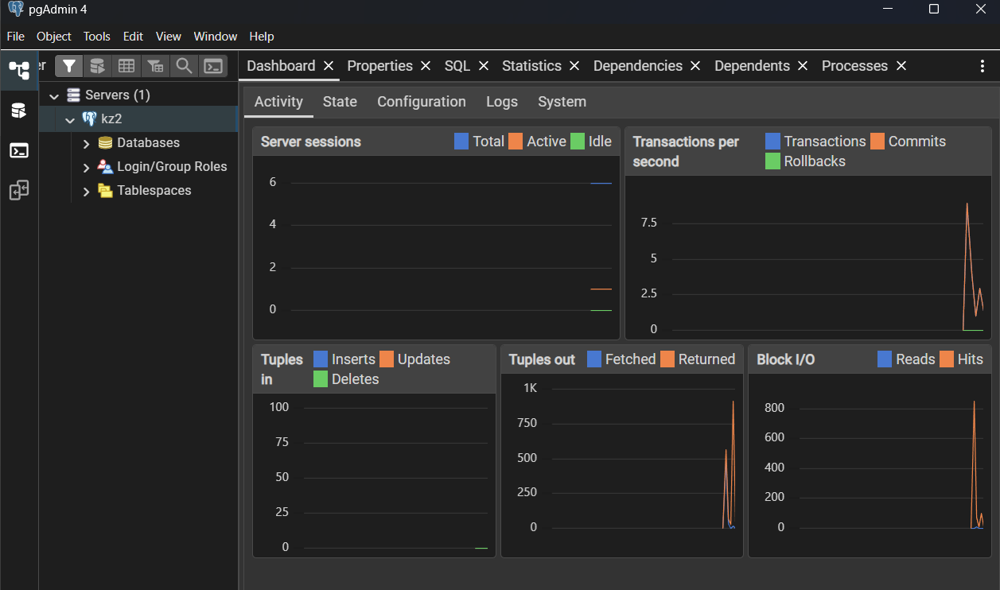
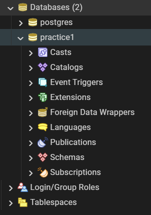
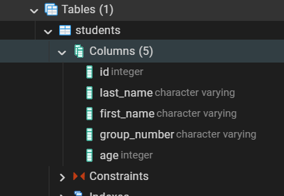
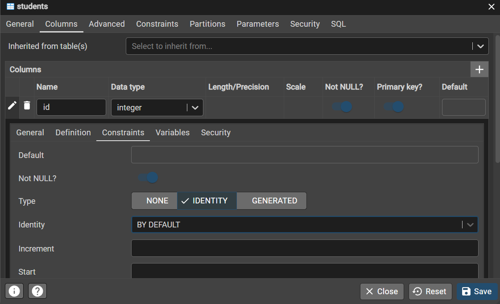
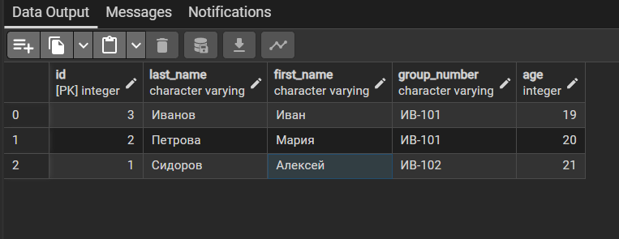
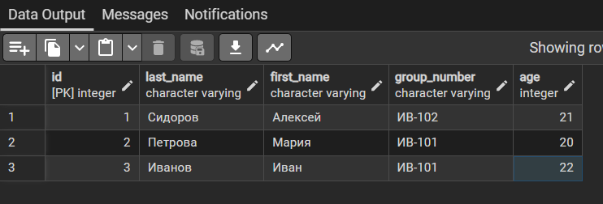
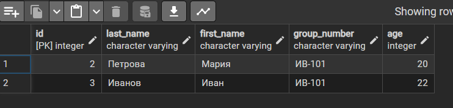
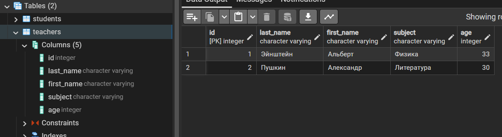

# Практическая работа «Первые шаги в Postgr eSQL через pgAdmin»

## Задание 1. Подключение к серверу

## Задание 2. Создание базы данных

## Задание 3. Создание таблицы

## Задание 4. Настройка автоувеличения поля id

## Задание 5. Добавление записей

## Задание 6. Изменение записи

## Задание 7. Удаление записи

## Задание 8. Самостоятельно

## Контрольные вопросы

1. Чем база данных отличается от таблицы?

База данных может содержать много таблиц, к тому же она содержит сведения о типах полей, обеспечивает проверку данных, может содержать миллионы записей, содержит информацию для безопасности

А таблица - это всего лишь данные, записанные в виде строк и колонок.

2. Что такое поле и что такое запись?

Поле - это одна характеристика обьекта (соответствует колонке, например возраст).

Запись - вся информация об обьекте (соответсвует всей строке таблицы например id + ФИО + возраст + группа)

3. Зачем нужно поле id и почему оно помечено как Primary Key?

Самое важное это зачем оно нужно - это для ссылок на обьект из других таблиц т.к. это поле всегда уникальное среди всех записей в таблице.
Также это поле гарантирует уникальность записей. 

Поле помечают как Primary Key чтобы СУБД автоматически включила для него    три строгих правила: Запрет на дубликаты; Запрет на пустоту; Автоматический индекс

4. Что происходит, если при добавлении записи оставить поле id пустым?

Т.к. id первичный ключ субд назначит его автоматически

5. Как изменить значение уже введённой записи?

Согласно CRUD - это операция называется UPDATE
(в pgadmin можно правой клавишей на таблице View/Edit Data).
